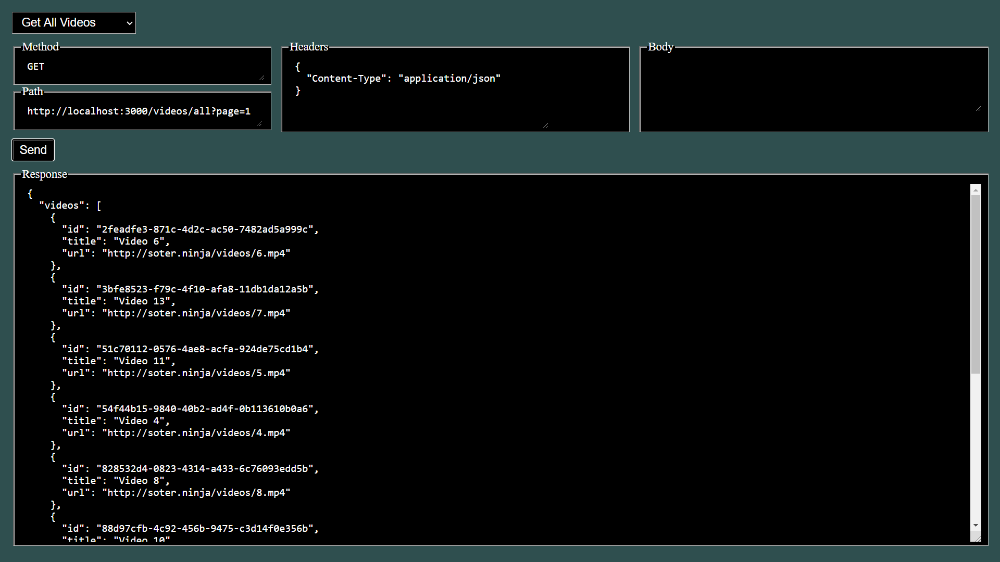

# FutureTube-Back



## Stack

* Bcrypt
* Cors
* Dotenv
* Express
* Jsonwebtoken
* Knex
* MySql
* Uuid

## Running the project

1. Clone this repository into your machine
1. Open your CLI inside the cloned repo and run the following commands:

   * `npm install`
   * `touch .env`
   * `start .env`
  
1. Paste the following environment variables into your **.env** file, replacing their values for those of your own SQL database:
    ```
    DB_HOST = mysql
    DB_USER = me
    DB_PASSWORD = xxxxxx
    DB_NAME = myschema
    JWT_KEY = xxxxxx
    ```
1. Run the following queries on your SQL database:
    ```SQL
     CREATE TABLE future_tube_users (
        id VARCHAR(255) PRIMARY KEY,
        name VARCHAR(255) UNIQUE NOT NULL,
        email VARCHAR(255) UNIQUE NOT NULL,
        birth_date DATE NOT NULL,
        password VARCHAR(255) NOT NULL,
        profile_picture VARCHAR(255) NOT NULL
    );
    ```
    ```SQL
     CREATE TABLE future_tube_videos (
        id VARCHAR(255) PRIMARY KEY,
        title VARCHAR(255) NOT NULL,
        description VARCHAR(255),
        url VARCHAR(255) NOT NULL,
        user_id VARCHAR(255),
        FOREIGN KEY (user_id) REFERENCES future_tube_users (id)
    );
    ```
    
1. Run `npm run start` on your CLI

1. Open your browser's *localhost* and test the endpoints using this project's own GUI. You'll find templates for all available requests, but feel free to send them via other softwares such as Postman.

## Notes

* When creating a new user, `birthDate` must be in format **YYYY-MM-DD**
* On *Get User Uploads* endpoint, you can use either a valid token as `authorization` in the request headers or an existing ID as a query parameter.
